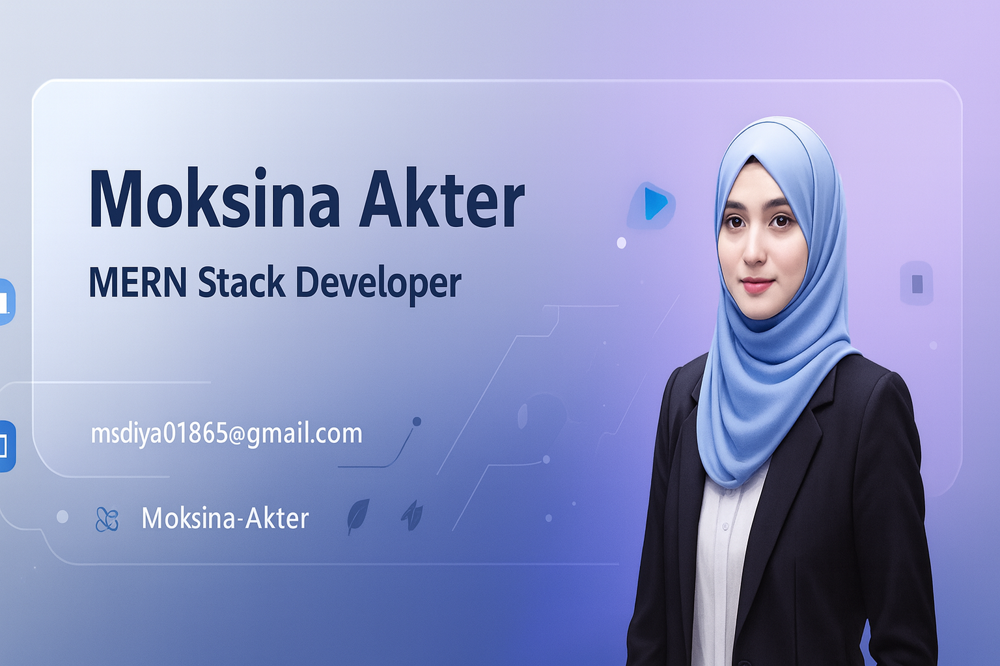

  

<h1 align="center">Hi 👋, I'm Moksina Akter</h1>
<h3 align="center">Frontend & MERN Stack Developer from Bangladesh</h3>

  
  
  

---

### 👩‍💻 About Me

- 💻 Passionate **Frontend & MERN Stack Developer** building responsive web apps.
- 🎨 Skilled in **HTML, CSS, TailwindCSS, DaisyUI, JavaScript (ES6+), React.js, React Router, Node.js, Express.js, MongoDB, Firebase**.
- 🖌️ Experienced in **UI/UX design** using **Figma & Adobe Illustrator**.
- 🌱 Love **clean, maintainable code** and continuously learning new technologies.

---

### 🛠️ Tech Stack

  
  
  

  
  
  
  
  
  

---

### 🌱 Currently Learning

- ⚡ Advanced **Express.js & Backend Development**
- ⚡ **React.js Optimization & Performance**

---

### 💬 Ask Me About

- 🌐 MERN Stack (React, Node, Express, MongoDB)
- 🎨 Frontend Design & UI/UX
- 🛠️ Full-stack Project Development

---

### 📂 Projects

| Project           | Description                                     | Tech Stack                          |
| ----------------- | ----------------------------------------------- | ----------------------------------- |
| Portfolio Website | Personal portfolio showcasing projects & skills | React.js, TailwindCSS, DaisyUI      |
| Resume Builder    | Build and export resumes online                 | React.js, Firebase                  |
| E-commerce App    | Full MERN stack CRUD project                    | React.js, Node.js, Express, MongoDB |

---

### 📈 GitHub Stats

  
  

